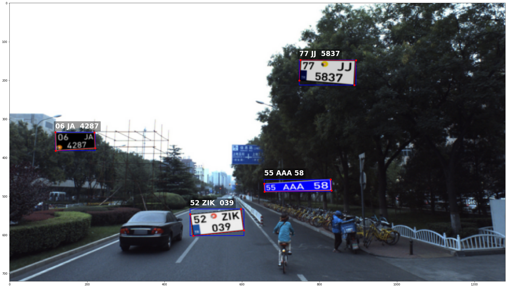

# ML.Synthetic.LicensePlate.Generator
Synthetic License Plate generator for ML Model Training

The generator supports custom license plate generation. Which means, given the country spesific configuration file and other assets,
this generator can generate a modestly realistic license plate image. 
And place the generated license plate on a given background. (Ocation of the license plates on the bacground can be limited)

Also the generator gives the label details for the generated license plate.

PS. Please be aware, I am no python developer, this was my first attempt to write code in python.
Also this project is far from finished, polished and being served. 

Output with borders and labels around the generated and placed license plates

52 ZIK  039
Box(is_relative=False, left=466.0, top=533.0, right=605.0, bottom=602.0)
[Corner(x=546.0, y=466.0), Corner(x=602.0, y=474.0), Corner(x=588.0, y=605.0), Corner(x=533.0, y=597.0)]

06 JA  4287
Box(is_relative=False, left=118.0, top=334.0, right=221.0, bottom=382.0)
[Corner(x=334.0, y=118.0), Corner(x=382.0, y=119.0), Corner(x=375.0, y=221.0), Corner(x=335.0, y=219.0)]

55 AAA 58
Box(is_relative=False, left=657.0, top=456.0, right=831.0, bottom=488.0)
[Corner(x=467.0, y=657.0), Corner(x=488.0, y=658.0), Corner(x=485.0, y=831.0), Corner(x=456.0, y=829.0)]

77 JJ  5837
Box(is_relative=False, left=748.0, top=147.0, right=894.0, bottom=212.0)
[Corner(x=200.0, y=748.0), Corner(x=147.0, y=751.0), Corner(x=148.0, y=894.0), Corner(x=212.0, y=890.0)]

License: (FFTDW) Feel free to do whatever you want with this repo.
